<div align="center">


# SmartCity

### Civic Issue Reporting & Urban Engagement Platform

*Report civic problems. Track resolution in real time. Build a better city — together.*

[](https://flutter.dev)
[](https://dart.dev)
[](https://supabase.com)
[](https://firebase.google.com)
[](https://www.openstreetmap.org)
[](LICENSE)

[Features](#-features) · [Screenshots](#-screenshots) · [Architecture](#-architecture) · [Getting Started](#-getting-started) · [Database](#-database-schema) · [API](#-supabase-rpc-functions) · [Contributing](#-contributing)

</div>

---

## 📖 Overview

**SmartCity** is a production-ready Flutter mobile application that empowers citizens to report, track, and follow up on civic infrastructure issues — potholes, drainage failures, garbage accumulation, street light outages, water leakages, and encroachments — directly from their smartphones.

Built with a zero-cost infrastructure stack (Supabase + OpenStreetMap + Firebase Spark), the app bridges the gap between citizens and municipal authorities through real-time communication, transparent status tracking, and community-driven issue prioritisation.

> **VTU Internship Project — 2026** · Shimoga City Corporation, Karnataka

---

## ✨ Features

### For Citizens

| Feature | Description |
|---|---|
| 📍 **GPS Issue Reporting** | Auto-detects location with reverse geocoding; manual retry fallback |
| 📸 **Photo Attachment** | Camera or gallery pick with automatic compression (70% quality, max 1920px) |
| 🗺️ **Live City Map** | OpenStreetMap with color-coded pins by status; category filter; map/list toggle |
| 📋 **My Reports** | Real-time stream of personal issues with full status lifecycle |
| 🔔 **Smart Notifications** | Auto-generated alerts for Report Received, Status Updated, and Issue Resolved events |
| ⬆️ **Community Upvoting** | Vote on issues you care about; optimistic UI with instant feedback |
| 🏆 **Achievement Badges** | 12 gamified badges across Bronze, Silver, and Gold tiers with unlock celebrations |
| 🌐 **Multilingual UI** | Full support for English, हिंदी, and ಕನ್ನಡ |

### For Municipal Admins

| Feature | Description |
|---|---|
| 📊 **Dashboard Overview** | Live counts, top-priority issues preview, category breakdown |
| 🗂️ **Issue Management** | Search, filter by status, sort by upvotes or date |
| 🗺️ **Admin Map View** | All issues on a single map with tap-to-manage bottom sheet |
| 📈 **Analytics** | Resolution rate, weekly trend chart, status distribution pie chart, category performance |
| ✏️ **Status Updates** | Move issues through Pending → In Progress → Resolved with optional resolution notes |
| 🔴 **Priority Signals** | Community upvote counts surfaced on every issue card to guide attention |

---

## 📸 Screenshots

All screenshots are stored in the [`Synopsis/SS/`](Synopsis/SS/) folder at the root of this repository.

### Citizen Screens

| Splash | Login | Home Map |
|:---:|:---:|:---:|
| 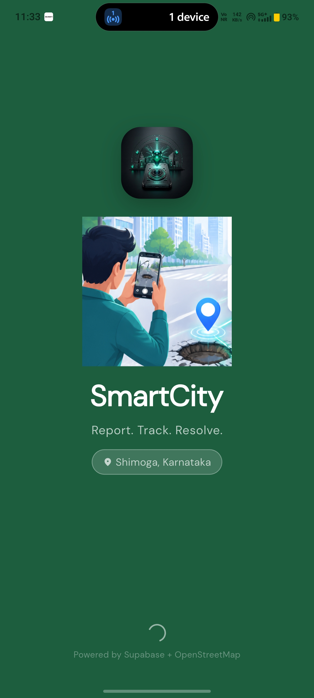 | 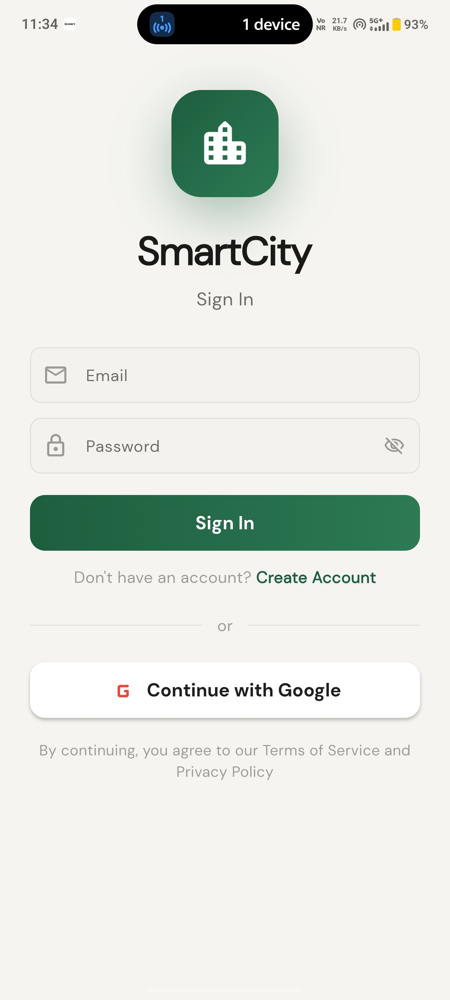 | 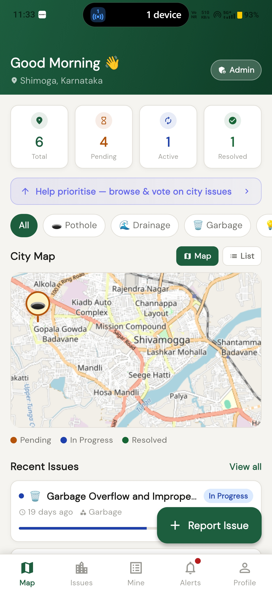 |

| Report Issue | My Reports | Issue Detail |
|:---:|:---:|:---:|
| 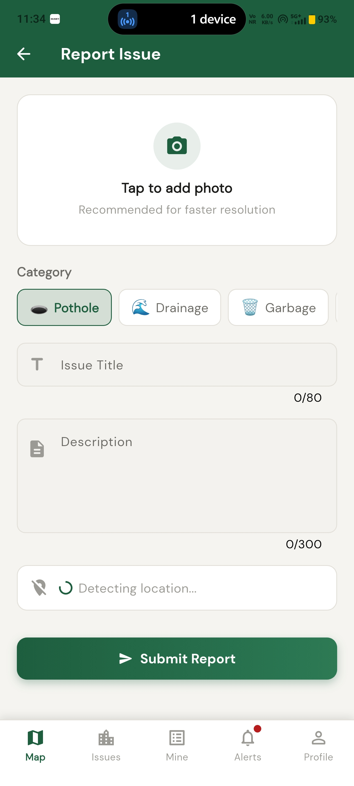 | 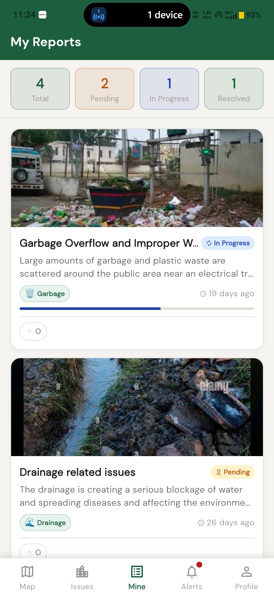 | 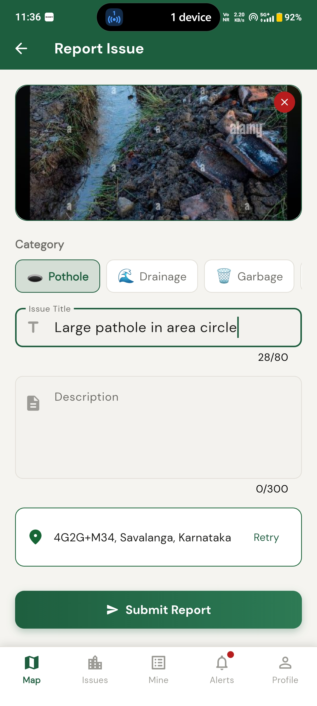 |

| City Issues (Voting) | Notifications | Profile |
|:---:|:---:|:---:|
| 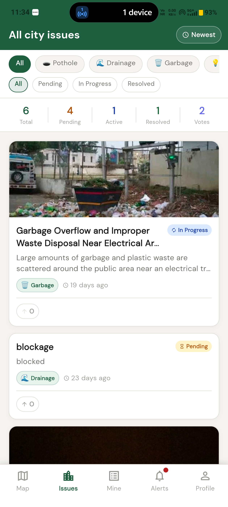 | 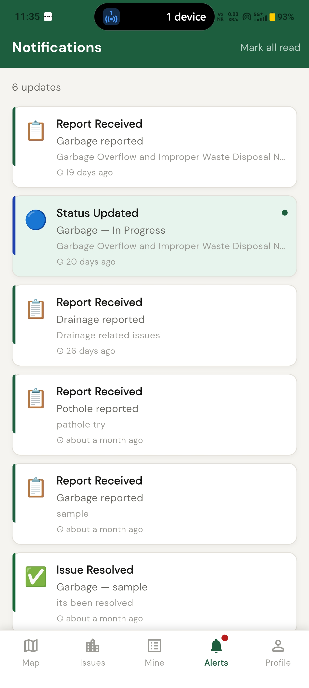 | 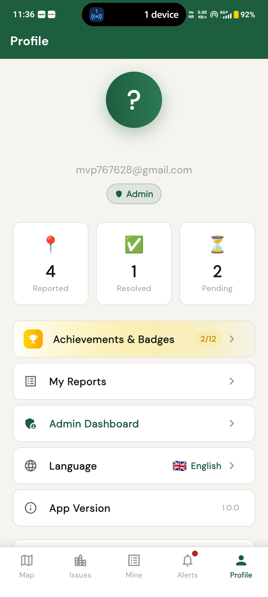 |

| Kannada | Hindi |
|:---:|:---:|
| 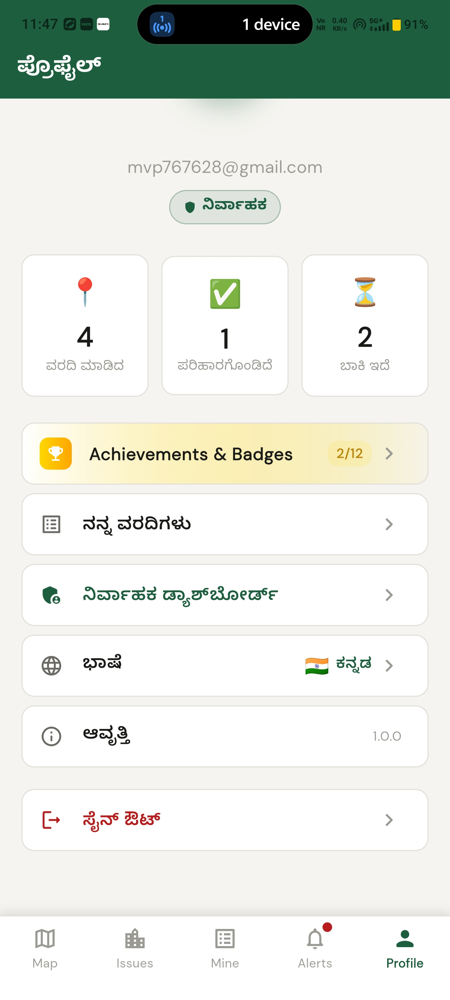 | 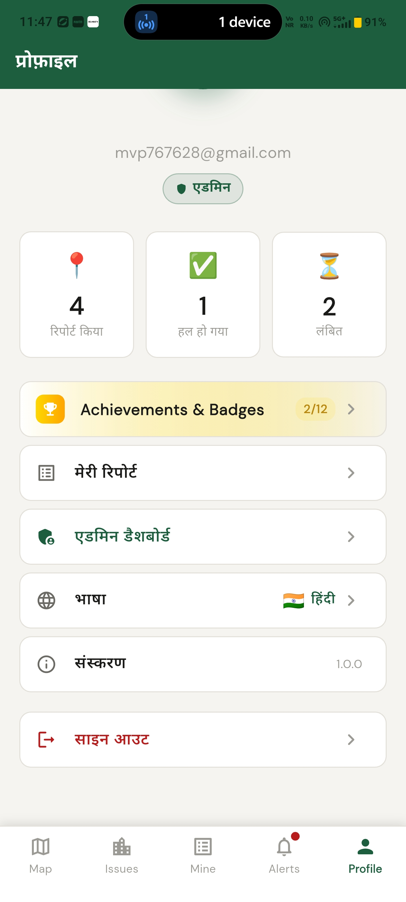 | 

### Badges & Gamification

| Badges Screen | Badge Detail | Badge Unlock Celebration |
|:---:|:---:|:---:|
| 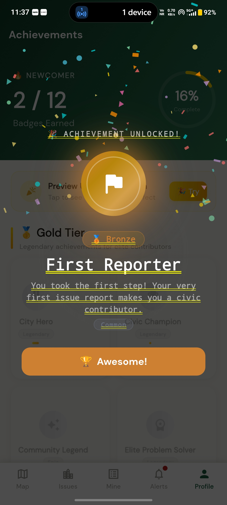 | 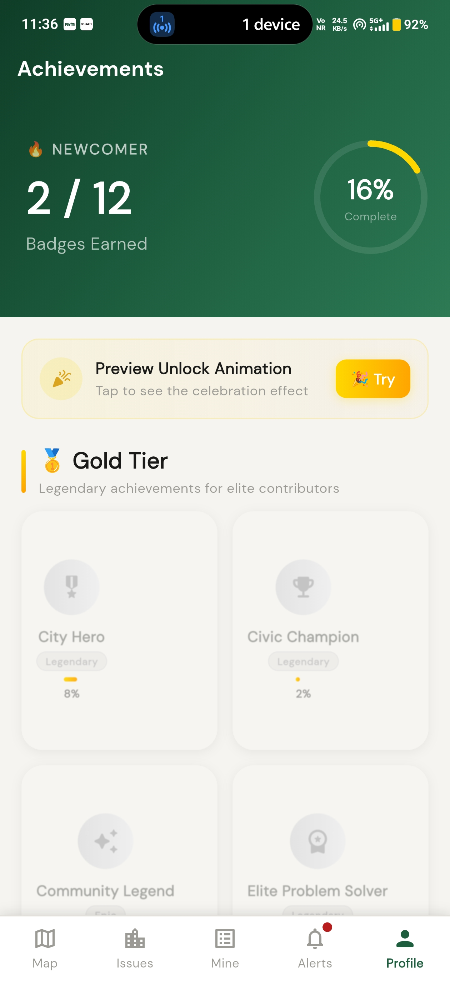 | 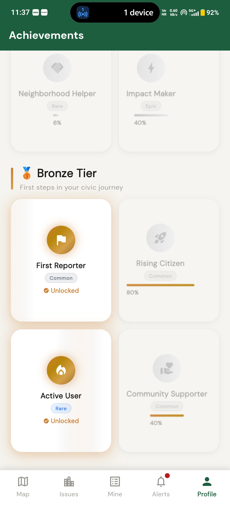 |

### Admin Screens

| Admin Dashboard | Issue Management | Admin Map |
|:---:|:---:|:---:|
| 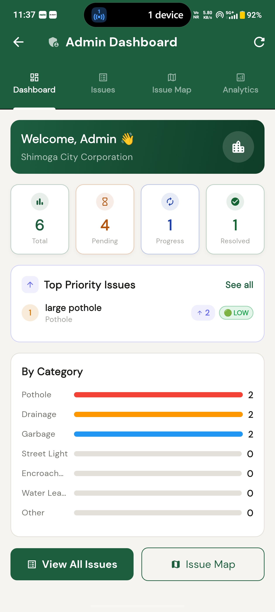 | 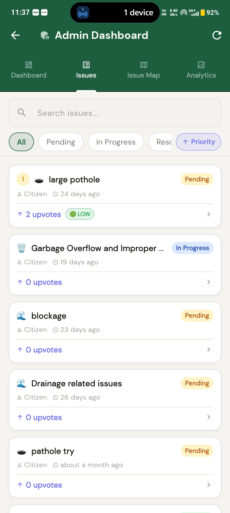 | 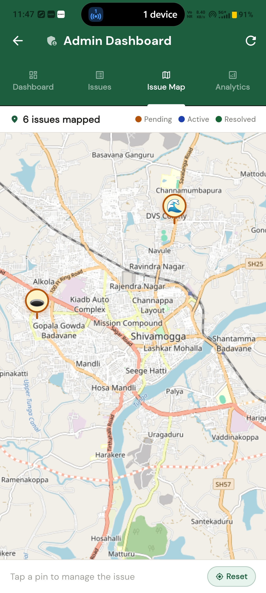 |

| Analytics | Admin Issue Detail | |
|:---:|:---:|:---:|
|  | 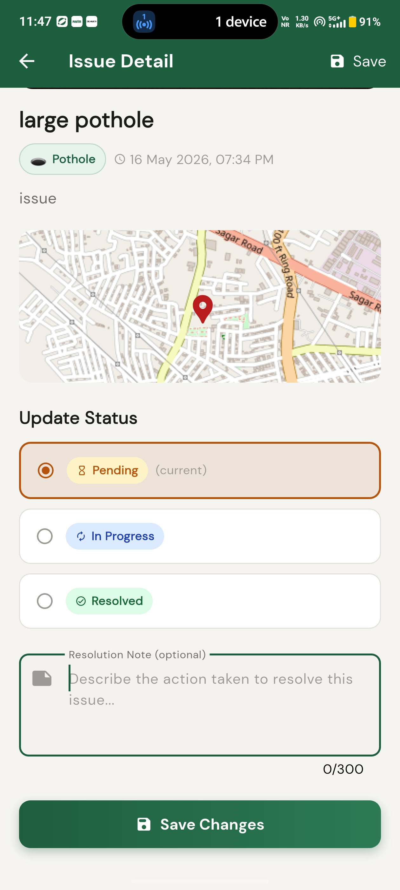 | |

> Screenshots are located at `Synopsis/SS/` in the repo root. If you are adding new screenshots, follow the existing filename convention and update the table above.

---

## 📁 Project Structure

```
SmartCityIssue_App/
├── .env                          # ← you create this (not committed)
├── pubspec.yaml
├── android/
│   └── app/
│       └── google-services.json  # ← you add this from Firebase
├── assets/
│   ├── images/logo.png
│   └── animations/splash.json
└── lib/
    ├── main.dart                 # App entry point, init sequence
    ├── app.dart                  # MaterialApp.router setup
    ├── core/
    │   ├── constants.dart        # Categories, statuses, map defaults
    │   ├── theme.dart            # Full design system (colors, components)
    │   ├── router.dart           # GoRouter + MainShell bottom nav
    │   └── l10n_extension.dart   # context.l10n convenience extension
    ├── models/
    │   ├── user_model.dart
    │   ├── issue_model.dart
    │   ├── status_history_model.dart
    │   ├── badge_model.dart      # Tier, rarity, gradient, glow helpers
    │   └── badge_data.dart       # Static definitions for all 12 badges
    ├── services/
    │   ├── supabase_service.dart # Singleton client accessor
    │   ├── auth_service.dart     # Sign in, sign out, profile upsert
    │   ├── issue_service.dart    # Full CRUD + streams + admin queries
    │   ├── storage_service.dart  # Compress → upload → public URL
    │   ├── location_service.dart # GPS permission + coordinates + address
    │   ├── notification_service.dart # FCM init + local notification display
    │   └── upvote_service.dart   # Toggle, check, bulk-fetch voted IDs
    ├── providers/
    │   ├── auth_provider.dart    # Auth state, user profile, isAdmin
    │   ├── issue_provider.dart   # Streams, filter state, admin providers
    │   ├── upvote_provider.dart  # Optimistic upvote state (family provider)
    │   ├── badge_provider.dart   # Computed badge progress from issue stream
    │   └── language_provider.dart
    ├── widgets/
    │   ├── app_widgets.dart      # IssueCard, StatusBadge, CategoryChip, etc.
    │   └── upvote_button.dart    # UpvoteButton + PriorityBadge
    ├── l10n/                     # ARB source files + generated Dart
    │   ├── app_en.arb
    │   ├── app_hi.arb
    │   ├── app_kn.arb
    │   └── app_localizations*.dart
    └── screens/
        ├── splash/
        ├── auth/
        ├── home/
        ├── report/
        ├── my_reports/
        ├── issue_detail/
        ├── notifications/
        ├── profile/
        ├── badges/
        │   ├── badges_screen.dart
        │   └── widgets/
        │       ├── badge_card.dart
        │       ├── badge_detail_dialog.dart
        │       ├── badge_unlock_dialog.dart
        │       ├── badge_progress_widget.dart
        │       └── confetti_painter.dart
        └── admin/
            ├── admin_dashboard_screen.dart
            └── admin_issue_detail_screen.dart
```

---

## Architecture

SmartCity follows a **feature-first layered architecture** with unidirectional data flow powered by Riverpod.

```
┌─────────────────────────────────────────────────────┐
│                    Presentation Layer                │
│         Screens  ·  Widgets  ·  Dialogs             │
└──────────────────────┬──────────────────────────────┘
                       │  watches / reads
┌──────────────────────▼──────────────────────────────┐
│                    State Layer                       │
│   Riverpod Providers  ·  Notifiers  ·  Streams      │
└──────────────────────┬──────────────────────────────┘
                       │  calls
┌──────────────────────▼──────────────────────────────┐
│                    Service Layer                     │
│   AuthService · IssueService · UpvoteService        │
│   StorageService · LocationService · Notification   │
└──────────────────────┬──────────────────────────────┘
                       │  queries
┌──────────────────────▼──────────────────────────────┐
│                   Data Layer                         │
│         Supabase PostgreSQL  ·  Realtime             │
│         Supabase Storage  ·  Firebase FCM            │
└─────────────────────────────────────────────────────┘
```

### Tech Stack

| Layer | Technology | Purpose |
|---|---|---|
| **UI Framework** | Flutter 3.x + Dart 3 | Cross-platform mobile |
| **State Management** | Riverpod 2.x | Providers, streams, computed state |
| **Backend / DB** | Supabase (PostgreSQL) | Auth, database, realtime, storage |
| **Authentication** | Supabase Auth | Email/password + Google OAuth |
| **Realtime** | Supabase Realtime | Live issue stream updates |
| **Storage** | Supabase Storage | Issue photo uploads |
| **Maps** | OpenStreetMap + flutter_map | Free, no billing, no API key |
| **GPS** | geolocator + geocoding | Location + reverse geocoding |
| **Push Notifications** | Firebase Cloud Messaging | Status update alerts |
| **Charts** | fl_chart | Pie chart, line chart |
| **Animations** | Lottie + AnimationController | Splash, badge celebrations |
| **Image Processing** | flutter_image_compress | Client-side compression before upload |
| **Localisation** | Flutter gen-l10n (ARB) | EN / HI / KN |
| **Typography** | Google Fonts — DM Sans | Consistent brand font |
| **Config** | flutter_dotenv | Secrets via `.env` |
| **Navigation** | GoRouter | Declarative routing with auth redirect |

> **Zero paid services.** Supabase free tier (500MB DB, 1GB storage, 50K reads/day) and Firebase Spark plan (FCM is always free) are sufficient for production demos.

---

## 🗂️ Repository Structure

```
smartcity/                          ← repo root
├── SmartCityIssue_App/             ← Flutter application
│   ├── .env                        ← you create this (not committed)
│   ├── pubspec.yaml
│   ├── android/
│   │   └── app/
│   │       └── google-services.json
│   ├── assets/
│   │   ├── images/logo.png
│   │   └── animations/splash.json
│   └── lib/
│       └── ...                     ← see Project Structure above
│
├── Synopsis/                       ← project documentation & media
│   └── SS/                         ← app screenshots (all screens)
│       ├── splash.jpg
│       ├── login.jpg
│       ├── home_map.jpg
│       ├── report_issue.jpg
│       ├── my_reports.jpg
│       ├── issue_detail.jpg
│       ├── city_issues.jpg
│       ├── notifications.jpg
│       ├── profile.jpg
|       ├── kannada.jpg
|       ├── hindi.jpg
│       ├── badges.jpg
│       ├── badge_detail.jpg
│       ├── badge_unlock.jpg
│       ├── admin_dashboard.jpg
│       ├── admin_issues.jpg
│       ├── admin_map.jpg
│       ├── admin_analytics.jpg
│       └── admin_issue_detail.jpg
│
└── README.md
```

---

## 🚀 Getting Started

### Prerequisites

- Flutter SDK `>=3.0.0`
- Dart SDK `>=3.0.0`
- A [Supabase](https://supabase.com) project
- A [Firebase](https://console.firebase.google.com) project (for FCM)
- Android Studio or VS Code with Flutter extension

### 1 — Clone the repository

```bash
git clone https://github.com/your-username/smartcity.git
cd smartcity
```

### 2 — Create your `.env` file

Create a `.env` file inside `SmartCityIssue_App/`. **Never commit this file.**

```env
SUPABASE_URL=https://your-project-id.supabase.co
SUPABASE_ANON_KEY=your-supabase-anon-key
```

Get these values from your Supabase project → **Settings → API**.

### 3 — Set up the Supabase database

Open **SQL Editor** in your Supabase dashboard and run `supabase_setup.sql` (see [Database Schema](#-database-schema) below for the full script).

### 4 — Configure Google OAuth

1. Supabase Dashboard → **Authentication → Providers → Google → Enable**
2. Get OAuth credentials from [Google Cloud Console](https://console.cloud.google.com) → APIs & Services → Credentials
3. Add the following **Authorized Redirect URIs**:
   ```
   io.supabase.smart_city://login-callback
   https://your-project-id.supabase.co/auth/v1/callback
   ```

### 5 — Add Firebase configuration

1. [Firebase Console](https://console.firebase.google.com) → New Project → Add Android App
2. Package name: `com.smartcity.app`
3. Download `google-services.json` → place in `SmartCityIssue_App/android/app/`

### 6 — Install dependencies and run

```bash
cd SmartCityIssue_App
flutter pub get
flutter run
```

---

## Database Schema

Run the following in Supabase SQL Editor:

```sql
-- ── Users ──────────────────────────────────────────────────────────────────
create table public.users (
  id        uuid primary key references auth.users(id) on delete cascade,
  name      text not null default '',
  email     text not null default '',
  role      text not null default 'citizen' check (role in ('citizen', 'admin')),
  fcm_token text,
  created_at timestamptz not null default now()
);

alter table public.users enable row level security;

create policy "Users can read and update their own profile"
  on public.users for all using (auth.uid() = id);

-- ── Issues ─────────────────────────────────────────────────────────────────
create table public.issues (
  id          uuid primary key default gen_random_uuid(),
  user_id     uuid not null references public.users(id) on delete cascade,
  title       text not null,
  description text not null default '',
  category    text not null,
  image_url   text,
  latitude    double precision not null,
  longitude   double precision not null,
  status      text not null default 'Pending'
                check (status in ('Pending', 'In Progress', 'Resolved')),
  admin_note  text,
  upvotes     integer not null default 0,
  created_at  timestamptz not null default now(),
  updated_at  timestamptz not null default now()
);

alter table public.issues enable row level security;

create policy "Anyone authenticated can read issues"
  on public.issues for select using (auth.role() = 'authenticated');

create policy "Citizens can insert their own issues"
  on public.issues for insert with check (auth.uid() = user_id);

create policy "Admins can update any issue"
  on public.issues for update using (
    exists (select 1 from public.users where id = auth.uid() and role = 'admin')
  );

-- ── Status History ──────────────────────────────────────────────────────────
create table public.status_history (
  id         uuid primary key default gen_random_uuid(),
  issue_id   uuid not null references public.issues(id) on delete cascade,
  old_status text not null,
  new_status text not null,
  changed_by uuid not null references public.users(id),
  changed_at timestamptz not null default now()
);

alter table public.status_history enable row level security;

create policy "Authenticated users can read status history"
  on public.status_history for select using (auth.role() = 'authenticated');

create policy "Admins can insert status history"
  on public.status_history for insert with check (
    exists (select 1 from public.users where id = auth.uid() and role = 'admin')
  );

-- ── Issue Upvotes ───────────────────────────────────────────────────────────
create table public.issue_upvotes (
  id         uuid primary key default gen_random_uuid(),
  issue_id   uuid not null references public.issues(id) on delete cascade,
  user_id    uuid not null references public.users(id) on delete cascade,
  created_at timestamptz not null default now(),
  unique (issue_id, user_id)
);

alter table public.issue_upvotes enable row level security;

create policy "Users can manage their own upvotes"
  on public.issue_upvotes for all using (auth.uid() = user_id);

-- ── Storage Bucket ──────────────────────────────────────────────────────────
insert into storage.buckets (id, name, public) values ('issue-images', 'issue-images', true);

create policy "Anyone can view issue images"
  on storage.objects for select using (bucket_id = 'issue-images');

create policy "Authenticated users can upload issue images"
  on storage.objects for insert with check (
    bucket_id = 'issue-images' and auth.role() = 'authenticated'
  );
```

---

## ⚡ Supabase RPC Functions

Atomic upvote counter updates — run in SQL Editor:

```sql
create or replace function increment_upvote(issue_id uuid)
returns void language sql security definer as $$
  update public.issues set upvotes = upvotes + 1 where id = issue_id;
$$;

create or replace function decrement_upvote(issue_id uuid)
returns void language sql security definer as $$
  update public.issues set upvotes = greatest(upvotes - 1, 0) where id = issue_id;
$$;
```

---

## 👑 Granting Admin Access

After a user signs in for the first time, promote them to admin via SQL:

```sql
update public.users
set role = 'admin'
where email = 'admin@example.com';
```

Sign out and back in. The **Admin Dashboard** link will appear in the Profile screen.

---

## 🌐 Localisation

The app ships with three fully translated locales:

| Language | Code | Coverage |
|---|---|---|
| English | `en` | 100% |
| हिंदी Hindi | `hi` | 100% |
| ಕನ್ನಡ Kannada | `kn` | 100% |

Translation files live in `SmartCityIssue_App/lib/l10n/` as ARB files. Generated Dart classes are in both `lib/l10n/` and `lib/generated/`.

To add a new language:
1. Create `lib/l10n/app_<code>.arb` modelled on `app_en.arb`
2. Add the `Locale('<code>')` to `supportedLocales` in `app.dart`
3. Run `flutter gen-l10n`

---

## 🏆 Badge System

Twelve achievement badges are awarded based on civic contribution milestones:

| Tier | Badge | Requirement |
|---|---|---|
| 🥇 Gold | City Hero | Report 50 issues |
| 🥇 Gold | Civic Champion | 40 issues resolved |
| 🥇 Gold | Community Legend | 100 total contributions |
| 🥇 Gold | Elite Problem Solver | 30 issues resolved |
| 🥈 Silver | Community Guardian | Report 25 issues |
| 🥈 Silver | Active Contributor | Report 20 issues |
| 🥈 Silver | Neighborhood Helper | 15 issues resolved |
| 🥈 Silver | Impact Maker | Report 10 issues |
| 🥉 Bronze | First Reporter | Report 1 issue |
| 🥉 Bronze | Rising Citizen | Report 5 issues |
| 🥉 Bronze | Active User | Report 3 issues |
| 🥉 Bronze | Community Supporter | Report 10 issues |

Badge progress is computed client-side from the existing issue stream — no additional database queries.

---

## 📊 Community Priority System

Issues are prioritised by community upvotes, surfaced across the citizen and admin experiences:

| Upvotes | Priority Level | Badge |
|---|---|---|
| 1 – 4 | Low | 🟢 LOW |
| 5 – 9 | Medium | 🟡 MEDIUM |
| 10 – 19 | High | 🟠 HIGH |
| 20+ | Critical | 🔴 CRITICAL |

The admin Issues tab defaults to **Priority sort** (most upvoted first) so the most urgent reports are always visible at the top.

---

## 🔔 Push Notifications

Device FCM tokens are stored in `users.fcm_token` and refreshed on every login. Notifications are dispatched when an admin changes an issue's status.

**Recommended trigger approach — Supabase Edge Function:**

```typescript
// supabase/functions/notify-citizen/index.ts
Deno.serve(async (req) => {
  const { fcm_token, title, body } = await req.json()
  await fetch('https://fcm.googleapis.com/fcm/send', {
    method: 'POST',
    headers: {
      'Authorization': `key=${Deno.env.get('FCM_SERVER_KEY')}`,
      'Content-Type': 'application/json',
    },
    body: JSON.stringify({
      to: fcm_token,
      notification: { title, body },
    }),
  })
  return new Response('ok')
})
```

Deploy with `supabase functions deploy notify-citizen`.

---

## 🏗️ Build & Release

**Debug build**
```bash
cd SmartCityIssue_App
flutter run
```

**Release APK**
```bash
flutter build apk --release
# Output: build/app/outputs/flutter-apk/app-release.apk
```

**Release App Bundle (Play Store)**
```bash
flutter build appbundle --release
# Output: build/app/outputs/bundle/release/app-release.aab
```

---

## 🔐 Environment Variables

| Variable | Description | Where to find |
|---|---|---|
| `SUPABASE_URL` | Your Supabase project URL | Supabase → Settings → API |
| `SUPABASE_ANON_KEY` | Supabase anonymous/public key | Supabase → Settings → API |

> The `.env` file is loaded at runtime via `flutter_dotenv`. Add `.env` to `.gitignore` — never commit secrets.

---

## 🤝 Contributing

Contributions, issues, and feature requests are welcome.

1. Fork the repository
2. Create a feature branch: `git checkout -b feature/your-feature`
3. Commit your changes: `git commit -m 'feat: add your feature'`
4. Push to the branch: `git push origin feature/your-feature`
5. Open a Pull Request

Please follow the existing code style and ensure your branch builds cleanly before submitting.

---

## 📄 License

This project is licensed under the **MIT License** — see the [LICENSE](LICENSE) file for details.

---

<div align="center">

Built with ❤️ using Flutter & Supabase

*SmartCity — Report. Track. Resolve.*

</div>